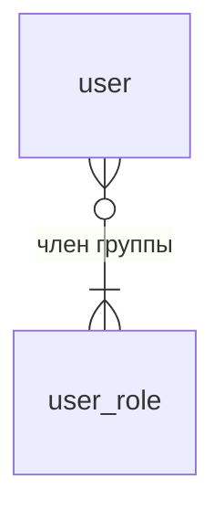

### Модуль «Учётные записи» (`Accounts`)

#### Функциональные возможности

- Создание учётной записи отдельного пользователя
- Возможность аутентификации пользователя посредством ввода пароля
- Возможность сброса пароля посредством аутентификации иными способами
- Возможность авторизации запросов пользователя
- Группировка пользователей в роли
- Управление привязки пользователей к организации
- Хранение истории изменений данных учётной записи

#### Технические требования

- Сервис должен функционировать с учётом требований НПА о защите персональных данных.
- Все принимаемые данные должны проходить валидацию на соответствие требуемому типу.
- По умолчанию формируются роли `service` - _Сервис_, `admin` - _Администратор системы_, `user` - _Пользователь системы_
    - Роль `system` применяется для доступа от имени внутренних сервисов информационной системы.
    - Роль `admin` позволяет:
        - управлять организациями;
        - управлять учётными записями пользователей;
        - назначать роли пользователей.
- При регистрации пользователю присваивается роль `user`.

#### Обрабатываемые данные

| Наименование типа данных                          | Идентификатор типа            | Формат значения   | Ограничения (нормальная форма) значения  |
| -                                                 | -                             | -                 | -                     |
| **Учётная запись пользователя**                   | user                          | | |
| Локальный уникальный идентификатор учётной записи | id                            | integer           | > 0                   |
| Фамилия                                           | surname                       | string            | `[А-ЯЁ][а-яё-]+`      |
| Имя                                               | name                          | string            | `[А-ЯЁ][а-яё-]+`      |
| Отчество                                          | patronymic                    | string            | `[А-ЯЁ][а-яё- ]+`     |
| Адрес электронной почты                           | email_address                 | string            | `[\w\.-]+@([\w-]+\.)+[\w-]{2,20}` |
| Флаг верификации адреса электронной почты         | is_email_address_verified     | boolean           | |
| Номер телефона мобильной связи операторов РФ      | phone_number                  | string            | `79\d{9}`             |
| Флаг верификации номера телефона                  | is_phone_number_verified      | boolean           | |
| Пароль                                            | password                      | string            | `[A-Za-z0-9!@#$%^&*()=+_:;<>,.{}\|\/[\]-]{8,32}`   Хэш пароля хранится в формате bcrypt2   Значение пароля скрывается на этапе сериализации при журналировании запросов. |
| Флаг активности учётной записи                    | is_active                     | boolean           |                       |
| Дата деактивации учётной записи                   | deactivated_at                | datetime          |                       |
| **Роль пользователя**                             | role                     | | |
| Локальный уникальный идентификатор роли           | code                          | string            | `[a-z]+`              |
| Наименование роли                                 | name                          | string            | `([А-Яа-яЁё]+ ?)+`    |

#### Модель данных

#### Диаграмма последовательности

```mermaid
sequenceDiagram
    actor U as Клиент
    box Сервис<br/>«Учетные записи»
    participant A as API Сервиса
    participant B as СУБД Сервиса
    end
    participant S as Сервис<br/>«Уведомления»
    
    Note over U, S: Создание учётной записи
        U->>A: Запрос на создание учётной записи
    activate U
    activate A
        A->>B: Сохранение сведений об учётной записи
    activate B
    break Если УЗ с указанным<br/>номером телефона/email существует
        B-->>A: Конфликт при добавлении учётной записи
        A-->>U: Уведомление об уже<br/>зарегистрированной УЗ<br/>с предоставленными уникальными идентификаторами [409]
    end
        B->>B: Сохранение учётных данных
        B-->>A: Отправка уникального идентификатора УЗ
    deactivate B
        B->>B: Формирование токена JWT
        A-->>U: Подтверждение регистрации<br>Отправка JWT [201]
    deactivate U
    deactivate A
    
    Note over U, S: Верификация номера телефона/email
    activate U
        U->>A: Запрос на подтверждение<br/>номера телефона/email + JWT
    activate A
        A->>A: Проверка таймаута ранее отправленного кода
    break Таймаут отправки предыдущего кода ещё не истёк
        A-->>U: Превышение числа попыток отправки кода [429]
    end
    A->>A: Формирование и сохранение кода верификации
    A->>S: Запрос на отправку кода верификации
    activate S
    break Если при отправке кода возникла ошибка
        S-->>A: Уведомление о сбое отправки сообщения 
        A-->>U: Уведомление о сбое отправки сообщения [502]
    end
        S-->>A: Уведомление об успешной отправке кода
    deactivate S    
        A-->>U: Уведомление об успешной отправке кода [200]
    deactivate A
    deactivate U

    U->>A: Отправка кода верификации
    activate U
    activate A
    A->>A: Проверка кода верификации
    break Если код верификации не прошел проверку
        A-->>U: Уведомление о некорректном<br/>коде верификации [422]
    end
    A->>B: Сохранение отметки о подтверждении идентификатора
    A-->>U: Уведомление о подтверждении<br/>номера телефона/email [200]
    deactivate U
    deactivate A

    Note over U, S: Аутентификация
    U->>A: Запрос на аутентификацию<br/>(номер телефона/email + пароль)
    activate U
    activate A
    A->>B: Запрос данных об учётной записи
    activate B
    B-->>A: Сведения об учётной записи
    deactivate B
    break Если УЗ не найдена
        A-->>U: Ошибка аутентификации [422]
    end
    alt Аутентификация по номеру телефона
        A->>A: Формирование кода верификации
        A->>S: Запрос на отправку кода верификации
        activate S
        break Если при отправке кода возникла ошибка
            S-->>A: Уведомление о сбое отправки сообщения 
            A-->>U: Уведомление о сбое отправки сообщения [502]
        end
        S-->>A: Уведомление об успешной отправке кода
        deactivate S    
        A-->>U: Уведомление об успешной отправке кода [200]
        deactivate A
        deactivate U
        U->>A: Отправка кода верификации
        activate U
        activate A
        A->>A: Проверка кода верификации
        break Если код верификации не прошел проверку
            A-->>U: Уведомление о некорректном<br/>коде верификации [422]
        end
        A-->>U: Отправка токена JWT [200]
    else Аутентификация по почте и паролю
        A->>A: Сравнение вычисленного и хранимого хэша пароля bcrypt2
        break Если сравнение неуспешно
            A-->>U: Ошибка аутентификации [422]
        end
        A-->>U: Отправка токена JWT [200]
    end
    deactivate A
    deactivate U
    
    Note over U, S: Восстановление пароля
        U->>A: Запрос на восстановление пароля<br/>(email/номер телефона)
    activate A
    activate U
    deactivate U
        A->>B: Запрос данных об УЗ
    activate B
    break Если УЗ не существует [404]
        B-->>A: Уведомление об отсутствии УЗ
        A-->>U: Уведомление об отсутствии УЗ
    activate U
    deactivate U
    end
        B-->>A: Отправка данных об УЗ [200]
    deactivate B
        A->>A: Генерация кода восстановления
        A->>S: Запрос отправки кода восстановления
    activate S
    break Если возникла ошибка<br/>при отправке кода восстановления [500]
        S-->>A: Уведомление об ошибке<br/>при отправке кода восстановления
        A-->>U: Уведомление об ошибке<br/>при отправке кода восстановления
    activate U
    deactivate U
    end
    par 
        S-->>A: Уведомление об успешной отправке кода восстановления
        A-->>U: Уведомление об успешной отправке кода восстановления
        activate U
    and
        S-->>U: Отправка кода восстановления
    end
    deactivate S
        U->>A: Отправка кода восстановления
    deactivate U
        A->>A: Проверка кода восстановления
    break Если код восстановления не прошел проверку [404]
        A-->>U: Уведомление о некорректности кода восстановления
    activate U
    end
        A-->>U: Отправка JWT
    deactivate A
    deactivate U    
```

